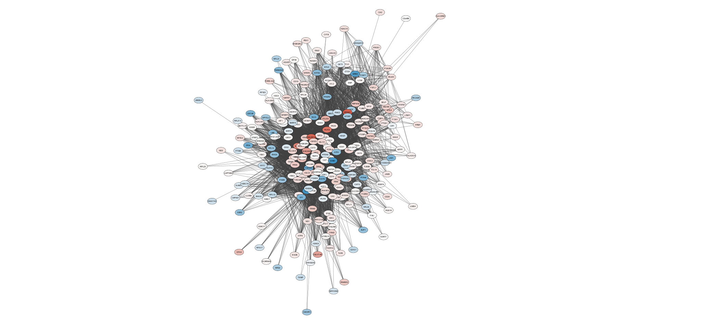
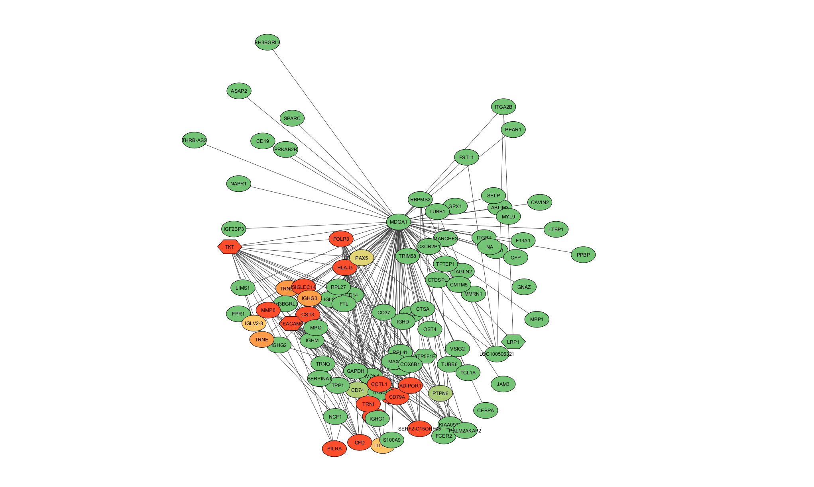
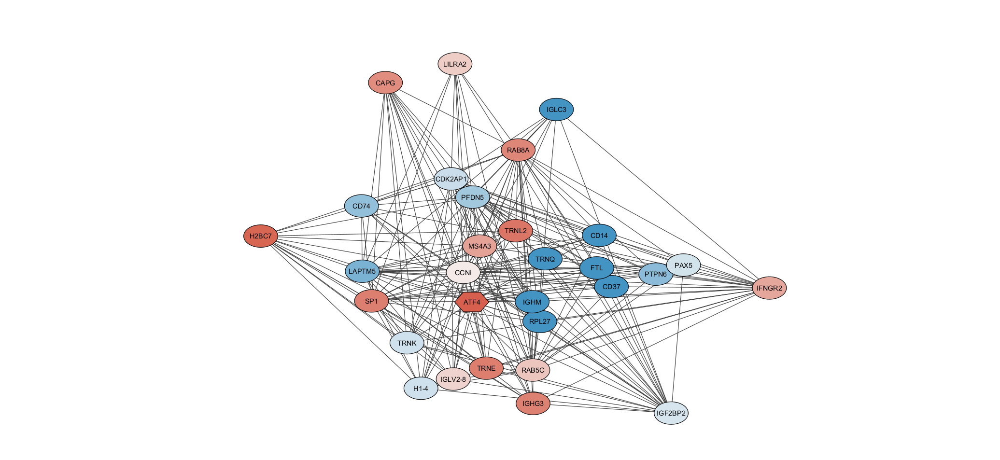
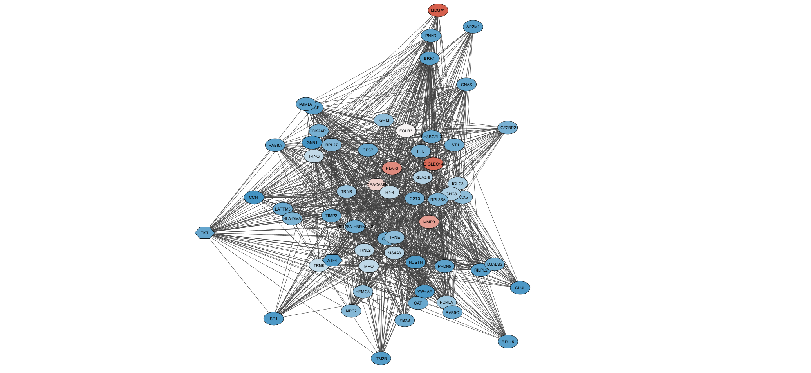
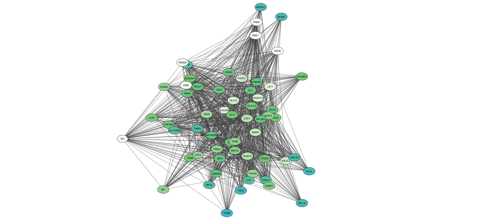
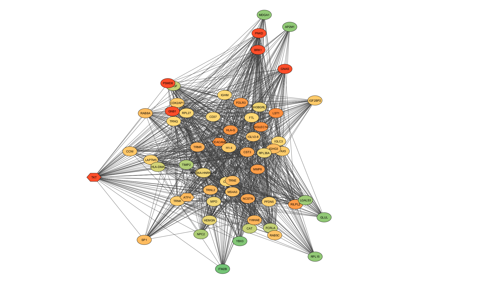
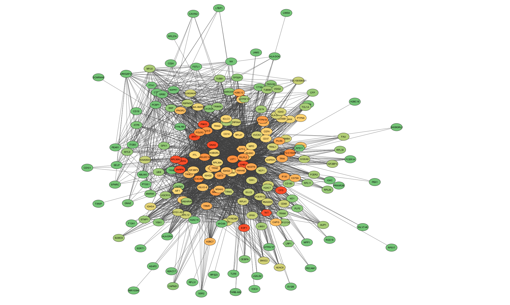

<style>
pre code, pre, code {
  white-space: pre !important;
  overflow-x: auto !important;
  word-break: keep-all !important;
  word-wrap: initial !important;
}
body {
.lightgreen table {
  background-color:#eff8e5;
}

.yellow table {
  background-color:#ffff99;
}
text-align: justify}
</style>

```{r setup, include=FALSE}
knitr::opts_chunk$set(echo = TRUE)
library(dplyr)
library(ggplot2)
library(tidyr)
library(plotly)
library(infer) 
library(ggfortify)
library(broom)
library(tibble)
library(gridExtra)
library(rsample)
library(Biobase)
library(reshape2)
library(plyr)
library(e1071)
library(ShortRead)
library(rlang)
library(tidyverse)
library(rnaseqGene)

# For the second set of data
library(edgeR)
library(DESeq2)
library(limma)
# library(Glimma)
# library(gplots)
library(org.Mm.eg.db)
# library(RColorBrewer)
library(GEOquery)
library(tibble)
library(tidyverse)
library(gplots)
library(Homo.sapiens)
library(topGO)
```

# Introduction
## Background Information on the Biological Question
IgA nephropathy (IgAN), recognized as the most common form of primary glomerulonephritis worldwide, manifests as a complex interplay between genetic and environmental factors, leading to the aberrant regulation of immune and glycosylation processes (Rajasekaran et al., 2021). Key to IgAN's pathology is the abnormal glycosylation of the IgA1 immune protein, particularly the proliferation of galactose-deficient IgA1 (Gd-IgA1), influenced by a network of enzymes such as β1,3-galactosyltransferase (C1GALT1), Cosmc, and α2,6-sialyltransferase II (ST6GALNAc-II) (Ohyama et al., 2021). Despite the significant progress made in understanding these aspects, the nuanced mechanisms underlying these processes still remain largely obscured.

In recent years, the advent of high-throughput sequencing technologies and bioinformatics has brought into focus the role of non-coding RNAs, particularly microRNAs (miRNAs), in the regulation of various cellular processes, including those implicated in IgAN (Pawluczyk et al., 2021). miRNAs are small, non-coding RNA molecules that modulate gene expression post-transcriptionally, thereby influencing a myriad of biological processes, including cellular differentiation, proliferation, and apoptosis (Galagali & Kim, 2020). Dysregulated miRNA profiles have been implicated in several pathological states, including IgAN, emphasizing their potential as disease biomarkers and therapeutic targets (de Godoy Torso et al., 2021).

Network-based analysis has emerged as a powerful approach to unravel the complex interplay among biological entities, including genes, proteins, and miRNAs. By depicting these entities as nodes and their interactions as edges, network analysis provides a holistic view of biological systems, aiding in the identification of key players or hubs (Milano et al., 2022). miRNA networks can reveal essential interactions between miRNAs and their target genes, thereby unraveling the functional implications of dysregulated miRNAs in diseases, including IgAN (Condrat et al., 2020).

In the context of IgAN, where aberrant glycosylation of IgA1 and the subsequent formation of immune complexes play a critical role, understanding the regulatory network of miRNAs could provide key insights. For instance, prior studies have identified the role of miR-148b in the post-transcriptional regulation of C1GALT1, thereby affecting IgA1 O-glycosylation (Novak et al., 2018). Moreover, identifying and characterizing key miRNA hubs in the network could lead to the discovery of potential biomarkers and therapeutic targets. Through a combination of high-throughput sequencing, bioinformatics, and network analysis, this research aims to decode the miRNA regulatory network in IgAN. By identifying key miRNA hubs and their role in IgA1 glycosylation, we hope to deepen our understanding of the molecular pathogenesis of IgAN and uncover novel miRNA biomarkers.

Relevance of Finding a Biomarker for the Disease
The pursuit of suitable biomarkers for IgAN is of paramount importance in the quest for improving disease prognosis and management. A biomarker, ideally, should be able to provide crucial insights into the disease’s onset, progression, or response to treatment. This would significantly contribute to early detection, personalized therapeutic interventions, and real-time monitoring of disease progression or regression (Suzuki, 2019).

In the case of IgAN, the role of abnormal glycosylation of IgA1 and the implicated glycosyltransferases (C1GALT1, Cosmc, ST6GALNAc-II) in its pathogenesis makes them potential candidates for biomarkers (Knoppova et al., 2016). However, the current understanding of the underlying regulatory mechanisms remains far from complete.

The role of miRNAs, including miR-98-5p, opens an exciting new avenue in this context. Their ability to modulate various cellular processes, including the glycosylation of IgA1, potentially makes them excellent candidate biomarkers. miR-98-5p, in particular, has shown promise due to its influence on cytokines that may affect the glycosylation of IgA1 (Liu et al., 2020). Furthermore, miRNAs are stable, can be secreted into various bodily fluids, and can be accurately quantified, which adds to their potential as feasible clinical biomarkers (Condrat et al., 2020).

Therefore, the exploration of other miRNAs related to IgAN not only adds to our understanding of the disease but could also pave the way for the development of novel diagnostic and therapeutic strategies (Tripathy et al., 2023). For instance, if certain miRNAs could be definitively linked to disease progression or response to treatment, they could be targeted with specific therapies or used to tailor treatment plans on an individual basis (Li et al., 2009).

In summary, exploring the role of miRNA in IgAN is not merely an academic endeavor but has significant potential for real-world application in the form of innovative, personalized approaches to the diagnosis and treatment of this prevalent kidney disease. It represents an important step forward in nephrology, moving us closer to the ultimate goal of improving patient outcomes and quality of life.

## Relevance of Finding a Biomarker for the Disease
This study focused on understanding the role of miRNAs in IgA nephropathy (IgAN). The methodologies involved sample collection from chosen subjects, excluding those with systemic diseases. The samples primarily consisted of peripheral blood that was processed to isolate peripheral blood mononuclear cells (PBMCs). These isolated cells underwent miRNA and mRNA sequencing. To ensure the sequencing results' reliability, quantitative reverse transcription-polymerase chain reaction (qRT-PCR) was performed. Additionally, a Western blot analysis was carried out to ascertain protein levels. Transfection procedures were undertaken for gene expression manipulation, and cells were incubated post-transfection. The levels of IgA1 and Gd-IgA1 in serum were analyzed using enzyme-linked immunosorbent assays (ELISAs). The study also conducted a luciferase report and used a cytometric bead array (CBA) to measure specific human cytokines. Finally, the statistical analysis was performed using t-tests, ANOVA, and the Mann–Whitney U test, with a significance threshold of p<0.05.

Based on the results, the study found increased expression of miR-98-5p in peripheral blood mononuclear cells (PBMCs) from patients with IgA nephropathy (IgAN). Out of 1235 human miRNAs, 72 were found elevated and 91 decreased in IgAN patients compared to healthy controls. The study focused on 10 upregulated and 20 downregulated miRNAs, among which miR-98-5p was highly expressed in both IgAN patients and healthy subjects, with higher expression in IgAN patients. The study identified CCL3 as a potential target of miR-98-5p, with bioinformatic tools indicating the same binding sites. Transfection of miR-98-5p led to decreased luciferase activity of the reporter containing the CCL3 3′UTR, suggesting that miR-98-5p specifically targets CCL3. CCL3 was found to be downregulated in IgAN patients, with a negative correlation between CCL3 mRNA and miR-98-5p expression, suggesting that miR-98-5p targets CCL3. Elevated IL-6 levels were detected in IgAN patients. Experiments showed that reduced CCL3 expression increased IL-6 levels, and decreased expression of C1GALT1, a molecule known to be decreased in IgAN. Transfection of the miR-98-5p mimic resulted in reduced CCL3 and C1GALT1 expression, and increased IL-6 levels. However, co-transfection with the CCL3 plasmid attenuated these alterations, validating that miR-98-5p targets CCL3 and affects the C1GALT1 level.

From what I gather, study focuses on the role of miRNAs, particularly miR-98-5p, in kidney diseases, specifically IgA nephropathy (IgAN). Despite inconsistencies in earlier research concerning miRNAs, the authors identified 24 miRNAs with differential expression in kidney disease, selecting miR-98-5p for further study due to its evolutionary conservation and role in cytokine signaling. Their analysis reveals higher levels of miR-98-5p in IgAN patients compared to healthy controls, correlating with higher levels of Gd-IgA1, a glycosylated form of IgA1. Bioinformatics tools predict and experimental luciferase reporter assays validate that miR-98-5p targets a cytokine called CCL3, a molecule known to participate in immune responses. The study also observes downregulated CCL3 and upregulated IL-6 in IgAN patients. IL-6 has been linked to IgAN pathogenesis and is known to influence the glycosylation of IgA1. The authors establish a link between miR-98-5p, CCL3, and IL-6, demonstrating that overexpression of miR-98-5p leads to decreased CCL3 and C1GALT1 levels and increased IL-6 levels. The authors suggest that in IgAN, miR-98-5p may lead to CCL3 downregulation, which in turn may modify IL-6 expression levels, ultimately resulting in increased Gd-IgA1 production. This discovery could provide a potential therapeutic target for IgAN. However, they note the study's limitations including a small sample size and the lack of an animal model.

## Description of Study
This study focused on understanding the role of miRNAs in IgA nephropathy (IgAN). The methodologies involved sample collection from chosen subjects, excluding those with systemic diseases. The samples primarily consisted of peripheral blood that was processed to isolate peripheral blood mononuclear cells (PBMCs). These isolated cells underwent miRNA and mRNA sequencing. To ensure the sequencing results' reliability, quantitative reverse transcription-polymerase chain reaction (qRT-PCR) was performed. Additionally, a Western blot analysis was carried out to ascertain protein levels. Transfection procedures were undertaken for gene expression manipulation, and cells were incubated post-transfection. The levels of IgA1 and Gd-IgA1 in serum were analyzed using enzyme-linked immunosorbent assays (ELISAs). The study also conducted a luciferase report and used a cytometric bead array (CBA) to measure specific human cytokines. Finally, the statistical analysis was performed using t-tests, ANOVA, and the Mann–Whitney U test, with a significance threshold of p<0.05.

Based on the results, the study found increased expression of miR-98-5p in peripheral blood mononuclear cells (PBMCs) from patients with IgA nephropathy (IgAN). Out of 1235 human miRNAs, 72 were found elevated and 91 decreased in IgAN patients compared to healthy controls. The study focused on 10 upregulated and 20 downregulated miRNAs, among which miR-98-5p was highly expressed in both IgAN patients and healthy subjects, with higher expression in IgAN patients. The study identified CCL3 as a potential target of miR-98-5p, with bioinformatic tools indicating the same binding sites. Transfection of miR-98-5p led to decreased luciferase activity of the reporter containing the CCL3 3′UTR, suggesting that miR-98-5p specifically targets CCL3. CCL3 was found to be downregulated in IgAN patients, with a negative correlation between CCL3 mRNA and miR-98-5p expression, suggesting that miR-98-5p targets CCL3. Elevated IL-6 levels were detected in IgAN patients. Experiments showed that reduced CCL3 expression increased IL-6 levels, and decreased expression of C1GALT1, a molecule known to be decreased in IgAN. Transfection of the miR-98-5p mimic resulted in reduced CCL3 and C1GALT1 expression, and increased IL-6 levels. However, co-transfection with the CCL3 plasmid attenuated these alterations, validating that miR-98-5p targets CCL3 and affects the C1GALT1 level.

From what I gather, study focuses on the role of miRNAs, particularly miR-98-5p, in kidney diseases, specifically IgA nephropathy (IgAN). Despite inconsistencies in earlier research concerning miRNAs, the authors identified 24 miRNAs with differential expression in kidney disease, selecting miR-98-5p for further study due to its evolutionary conservation and role in cytokine signaling. Their analysis reveals higher levels of miR-98-5p in IgAN patients compared to healthy controls, correlating with higher levels of Gd-IgA1, a glycosylated form of IgA1. Bioinformatics tools predict and experimental luciferase reporter assays validate that miR-98-5p targets a cytokine called CCL3, a molecule known to participate in immune responses. The study also observes downregulated CCL3 and upregulated IL-6 in IgAN patients. IL-6 has been linked to IgAN pathogenesis and is known to influence the glycosylation of IgA1. The authors establish a link between miR-98-5p, CCL3, and IL-6, demonstrating that overexpression of miR-98-5p leads to decreased CCL3 and C1GALT1 levels and increased IL-6 levels. The authors suggest that in IgAN, miR-98-5p may lead to CCL3 downregulation, which in turn may modify IL-6 expression levels, ultimately resulting in increased Gd-IgA1 production. This discovery could provide a potential therapeutic target for IgAN. However, they note the study's limitations including a small sample size and the lack of an animal model.

## Strengths of the study design and potential weaknesses

### Methods
The study demonstrated numerous strengths in its methodological approach. It utilized a wide range of techniques including miRNA and mRNA sequencing, quantitative reverse transcription-polymerase chain reaction (qRT-PCR), Western blot analysis, ELISAs, and a cytometric bead array. This broad spectrum of methodologies allowed for comprehensive data collection and in-depth analyses. The study ensured high-quality RNA extraction and utilized advanced bioinformatics tools and databases to process large volumes of sequencing data. In addition to examining gene expression, the study also looked at protein expression, providing a thorough understanding of the biological processes involved. Lastly, rigorous statistical analyses were used, contributing to the robustness of the interpretation of the data.

However, there were also certain limitations in the study. Firstly, the sample size was small, with only three subjects from each group, which could limit the generalizability of the findings and increase the risk of statistical errors or bias. The experiments were performed using peripheral blood mononuclear cells (PBMCs) and lacked an experimental animal model, which could have provided more comprehensive and physiologically relevant findings. The study relied on indirect evidence and bioinformatics analyses without directly examining the relationship between miR-98-5p and glycosylation. Moreover, the study remains a correlational investigation as it does not establish a causative role of miR-98-5p in IgAN. Further research involving functional assays would be necessary to definitively ascertain causation.

### Results
The results of the study present several strengths. The study identified a specific pattern of miRNA expression, with 72 miRNAs upregulated and 91 downregulated in patients with IgA nephropathy (IgAN) compared to healthy controls. This comprehensive profiling of miRNA expression can provide important insights into the pathogenesis of IgAN. The data demonstrated a strong correlation between miR-98-5p and CCL3 expression, and further validated this correlation through luciferase activity experiments, indicating the potential of miR-98-5p as a therapeutic target. In addition, the study effectively showed the impact of manipulating miR-98-5p levels on the expression of CCL3, C1GALT1, and IL-6, thus unraveling the possible role of this miRNA in the inflammatory pathway implicated in IgAN. Furthermore, the discovery of elevated IL-6 levels and decreased C1GALT1 in IgAN patients provides new potential biomarkers for diagnosis or treatment monitoring.

While the study identified miR-98-5p as a potential therapeutic target, the exact mechanism by which it influences CCL3, C1GALT1, and IL-6 expression remains speculative. Even though the results suggest a connection between these molecules, causation has not been established. Also, the study did not investigate whether the alterations in C1GALT1 and IL-6 are a direct consequence of miR-98-5p upregulation or secondary effects. It would also be important to assess whether the alterations in miRNA expression and subsequent molecular changes have clinical implications, such as impacting disease progression or response to treatment in IgAN patients. Lastly, the generalizability of the results may be limited due to the small sample size. Further investigation with larger cohorts would strengthen the findings and their clinical relevance.

# Methods
## Data Acquisition:

Data for this study will be retrieved from the Gene Expression Omnibus (GEO) database, a public genomics data repository. Specifically, miRNA expression datasets (GSE145652) of blood samples from patients diagnosed with IgAN and healthy controls will be downloaded for further analysis.

## Data Preprocessing:

Raw data files will be imported into the R statistical environment for preprocessing. I will use the 'limma' and 'DESeq2' libraries for preprocessing and normalization to adjust for technical and biological replicates.

## Differential Expression Analysis:

Differential expression analysis between IgAN patients and healthy controls will be performed using the 'limma' package in R. Genes will be deemed significantly differentially expressed based on adjusted p-values (Benjamini-Hochberg method) and log2 fold-change thresholds. The resulting gene list will then be ranked based on the log2 fold change for subsequent analysis.

## Inferential Statistics:

Inferential statistics will be performed using R. This will include conducting t-tests and SAM, along with hierarchical clustering and k-means clustering for grouping the expression of miRNA between different groups. Correlation coefficients will also be calculated to assess the relationship between expression of genes for clustering.

## Functional Annotation:

The Database for Annotation, Visualization, and Integrated Discovery (DAVID) will be used for functional annotation of the differentially expressed genes. This will provide insights into the biological processes, cellular components, and molecular functions that are enriched among the differentially expressed genes.

## Gene Set Enrichment Analysis (GSEA):

To identify the pathways and biological processes enriched in our ranked gene list, aGene Set Enrichment Analysis (GSEA) will be done. The 'fgsea' package and `clusterProfiler` in R will be used for this purpose. GSEA results will be interpreted with attention to Normalized Enrichment Scores (NES), nominal p-values, and false discovery rate (FDR) q-values.

## Network Analysis:

For network analysis, the Cytoscape software will be used. It allows visualization of molecular interactions and pathways involved in the disease. Particularly, a network of interactions among the differentially expressed genes will be created, which might provide more comprehensive insights into the role of miR-98-5p in the context of IgAN. The network will then be saved and assessed by Neighborhood connectivity and MCODE Score from the MCODE tool. 


# Results
## Loading Data & Establishing A Few Variables
```{r 3.12, eval=TRUE, echo=TRUE, message=FALSE, warning=FALSE, class.source = "fold-show", cache=FALSE}
# Load Data ---------------------------------------------------------------


gset <- getGEO("GSE145652", GSEMatrix =TRUE, getGPL=FALSE)

sampleinfo = pData(gset[[1]])[, 1:3]
sampleinfo$status = factor(c(rep('CON',3), rep('IGA', 3)))
sampleinfo = as.data.frame(sampleinfo)


# load counts table from GEO
urld <- "https://www.ncbi.nlm.nih.gov/geo/download/?format=file&type=rnaseq_counts"
path <- paste(urld, "acc=GSE145652", "file=GSE145652_raw_counts_GRCh38.p13_NCBI.tsv.gz", sep="&");
tbl <- as.matrix(data.table::fread(path, header=T, colClasses="integer"), rownames=1)

# pre-filter low count genes
# keep genes with at least 2 counts > 10
keep <- rowSums( tbl >= 10 ) >= 2
tbl <- tbl[keep, ]
countsData <- tbl
# colnames(countsData) <- c('CON1', 'CON2', 'CON3', 'IGA1', 'IGA2', 'IGA3')
# log transform raw counts
# instead of raw counts can display vst(as.matrix(tbl)) i.e. variance stabilized counts
log.normalized.counts <- log10(tbl + 1)
colnames(log.normalized.counts) <- c('CON1', 'CON2', 'CON3', 'IGA1', 'IGA2', 'IGA3') 

```


## Differential Expression Analysis 
```{r 3.13, eval=TRUE, echo=TRUE, message=FALSE, warning=FALSE, class.source = "fold-show", cache=FALSE}
# Differential Expression Analysis ----------------------------------------


# Cleaning data for DESeq
meta.data <- data.frame(
  id = colnames(log.normalized.counts),
  condition = c(rep("control", times = 3), rep("IgA", times = 3))
)

# Establishing variables specifically for this dataset
conditions <- factor(c(rep("control", times = 3), rep("IgA", times = 3)))
design <- model.matrix(~0 + conditions)
colnames(design) <- levels(conditions)

# columns are not exact
col.data <- sampleinfo
col.data <- col.data[,c(1,3)]
# making sure the row names in col.data matches to column names in countsData
colnames(countsData) <- rownames(col.data)

# are they in the same order?
all(colnames(countsData) == rownames(col.data))


dds <- DESeqDataSetFromMatrix(countData = countsData,
                              colData = col.data,
                              design = ~ status)

# pre-filtering: removing rows with low gene counts
# keeping rows that have at least 10 reads total
keep <- rowSums(counts(dds)) >= 10
dds <- dds[keep,]

# Make sure that we have high reads
dds

# comparing other levels to untreated
dds$status <- relevel(dds$status, ref = "CON")

dds <- DESeq(dds)
res <- results(dds)

# DESeq Results
head(res)

# For Cytoscape
DESeq.analysis.table <- data.frame(res)

library(org.Hs.eg.db)

geneID <- rownames(res)
geneEnsembl <- mapIds(org.Hs.eg.db, keys = geneID, column = "ENSEMBL", keytype = "ENTREZID")
geneID <- rownames(res)
geneSymbol <- mapIds(org.Hs.eg.db, keys = geneID, column = "SYMBOL", keytype = "ENTREZID")

DESeq.analysis.table <- data.frame(ENTREZ = rownames(res),
                                   symbol_name = unname(geneSymbol), 
                                   ensembl_id = unname(geneEnsembl),
                                   DESeq.analysis.table)
# Sort by 'adj.P.Val' column in ascending order (lowest values first)
top.DESeq <- DESeq.analysis.table[order(DESeq.analysis.table$padj), ]
head(DESeq.analysis.table[order(DESeq.analysis.table$padj), ] , 15)
write.csv(DESeq.analysis.table, "DESeq.analysis.table.csv", row.names=FALSE)


# Limma differential expression analysis
# linear model fit off of Bayes moderation of standard errors
fit <- lmFit(countsData, design)
contrast.matrix <- makeContrasts(IgA - control, levels=design)
fit2 <- contrasts.fit(fit, contrast.matrix)
fit2 <- eBayes(fit2)

# Get the results and select differentially expressed miRNAs
results <- topTable(fit2, adjust="BH", number=Inf)


# Displaying results from limma analysis
geneID <- rownames(results)
geneEnsembl <- mapIds(org.Hs.eg.db, keys = geneID, column = "ENSEMBL", keytype = "ENTREZID")
geneID <- rownames(results)
geneSymbol <- mapIds(org.Hs.eg.db, keys = geneID, column = "SYMBOL", keytype = "ENTREZID")

limma.analysis.table2 <- data.frame(ENTREZ = rownames(results),
                                   symbol_name = unname(geneSymbol), 
                                   ensembl_id = unname(geneEnsembl),
                                   results)
head(limma.analysis.table2)
dim(limma.analysis.table2)
write.csv(limma.analysis.table2, "analysis.table.csv", row.names=FALSE)
```
    
  
In the DESeq2 differential expression analysis, I compared the 'IgA' samples to the control group ('CON'). The top three genes with the lowest adjusted p-values were 'LOC105374981', 'LOC105373117', and 'LOC101928512', showing log2FoldChanges of -1.965213, -2.589302, and -2.242986, respectively. Notably, 'MDGA1', 'FOSB', and 'HLA-DRB1' were also among the top genes in the analysis, with 'MDGA1' showing a significant increase in expression (log2FoldChange of 5.500477), and 'FOSB' and 'HLA-DRB1' showing decreased expression in the 'IgA' condition (log2FoldChanges of -2.796021 and 1.811390, respectively). The corresponding adjusted p-values indicated the results were statistically significant (p < 0.05).

Furthermore, in the limma analysis, the genes 'OTUD4', 'FAM199X', and 'EIF4A2' were the most differentially expressed when comparing the 'IgA' samples to the control group. However, it is important to note that the adjusted p-values for these genes were still above the typically accepted threshold (p < 0.05), highlighting the need for further investigations.


## Volcano Plot of DEG
```{r 3.2, eval=TRUE, echo=TRUE, message=FALSE, warning=FALSE, class.source = "fold-show", cache=FALSE}
# Volcano Plot of DEG -----------------------------------------------------

get_upregulated <- function(df){
  
  key <- intersect(rownames(df)[which(df$log2FoldChange>=1)], rownames(df)[which(df$pvalue<=0.05)])
  
  results <- as.data.frame((df)[which(rownames(df) %in% key),])
  return(results)
}

get_downregulated <- function(df){
  
  key <- intersect(rownames(df)[which(df$log2FoldChange<=-1)], rownames(df)[which(df$pvalue<=0.05)])
  
  results <- as.data.frame((df)[which(rownames(df) %in% key),])
  return(results)
}

library(EnhancedVolcano)
res1 <- na.omit(res)

min_width <- min(res1$log2FoldChange)
max_width <- max(res1$log2FoldChange)
max_height <- -log10(min(res1[res1$pvalue>0, 5]))

up <- subset(res1, res1$log2FoldChange > 1 & res1$pvalue <= 0.05)
up <- up[order(-up$log2FoldChange),]
up_list <- head(rownames(up), n=10L)

down <- subset(res1, res1$log2FoldChange < -1 & res1$pvalue <= 0.05)
down <- down[order(down$log2FoldChange),]
down_list <- head(rownames(down), n=10L)

plot_top_20 <- c(up_list, down_list)
EnhancedVolcano(res1,
                lab=rownames(res1),
                x="log2FoldChange",
                y="pvalue",
                selectLab=plot_top_20,
                drawConnectors=TRUE,
                FCcutoff=1.0,
                pCutoff=0.05,
                title="Volcano Plot",
                subtitle="IgAN vs. Control",
                # legendVisible=F,
                caption = paste0('Total Genes = ', nrow(res1)),
                xlim=c(min_width, max_width),
                ylim=c(0, max_height))
```
  
  
In the volcano plot analysis of the differential gene expression data, I used log2FoldChange and p-value cut-offs of 1.0 and 0.05, respectively, to categorize genes as significantly upregulated or downregulated. Among the entire set of genes analyzed, genes that passed these cut-off criteria were plotted in the Volcano Plot, providing a clear visual representation of the significantly dysregulated genes in IgA Nephropathy (IgAN) compared to controls. It should be noted that none of the presented genes in the figure were listed in the tables from the differential expression analysis. 

A significant number of genes were observed to be upregulated and downregulated in IgAN versus the control group, demonstrating the profound effect this condition has on gene expression patterns. The top 10 genes with the highest increase (positive log2FoldChange) and decrease (negative log2FoldChange) in expression were prominently marked on the volcano plot. These genes could potentially be the major drivers of IgAN and hence be valuable targets for therapeutic interventions. We will observe these high log fold changes in the network.


 
## Potential Biomarkers from Transcription Factors
```{r 3.3, eval=TRUE, echo=TRUE, message=FALSE, warning=FALSE, class.source = "fold-show", cache=FALSE}
# Potential Biomarkers/Transcription Factors ------------------------------

# Fetch the data from the Human TFs database
tf_data <- read_csv("http://humantfs.ccbr.utoronto.ca/download/v_1.01/DatabaseExtract_v_1.01.csv")

# Extract the list of TFs
known_TFs <- tf_data$`Ensembl ID`

# Print the first few TFs
head(known_TFs)

# Sorting the differentially expressed genes by adj.P.Val and logFC
sorted_analysis_table <- DESeq.analysis.table[order(DESeq.analysis.table$padj, -abs(DESeq.analysis.table$log2FoldChange)),]

# Select the top N genes as potential biomarkers
topN <- 300
potential_biomarkers <- sorted_analysis_table[1:topN,]

# Intersect the differentially expressed genes with known transcription factors
TF_intersect <- intersect(na.omit(sorted_analysis_table$ensembl_id), known_TFs)

# Select these transcription factors from the differentially expressed genes
potential_TF_biomarkers <- sorted_analysis_table[sorted_analysis_table$ensembl_id %in% TF_intersect,]

head(potential_TF_biomarkers,15)
write.csv(potential_TF_biomarkers, "potential_TF_biomarkers.csv", row.names=FALSE)
```
  
  
In this analysis, I have identified several potential transcription factor (TF) biomarkers related to the differential expression analysis (Lambert et al., 2018). From the differentially expressed genes, the top 300 genes were considered as potential biomarkers based on their adjusted p-value and absolute log2 fold change. The top 15 of these potential transcription factor biomarkers, ranked by their adjusted p-values, are shown in the table below. The ranking was conducted based on the adjusted p-value and the absolute value of the log2 fold change, indicating the statistical significance and the magnitude of the differential expression, respectively. Among these top 15 TFs, FOSB, HLA-DRB1, and SMYD3 are the three most significantly differentially expressed. Notably, FOSB shows a strong downregulation in IgAN compared to control (log2FoldChange = -2.796021, padj = 3.551910e-17), while HLA-DRB1 shows a significant upregulation (log2FoldChange = 1.811390, padj = 3.490739e-15).


## T-test and SAM Analysis
```{r HW4.1, eval=TRUE, echo=TRUE, message=FALSE, warning=FALSE, class.source = "fold-show", cache=FALSE}
# T-test and SAM ----------------------------------------------------------

# Pulling Likelihood Ratio Test P-values
res.pvalue.df <- data.frame(
  ID = top.DESeq$symbol_name,
  p.value = top.DESeq$pvalue,
  p.adj = top.DESeq$padj
)
head(res.pvalue.df)


get.t.test <- function(g.data, g.row){
  
  t.result <- try(t.test(g.data[g.row , 1:3], g.data[g.row , 4:6])$p.value)
  
  if(grepl(pattern = "Error", x = t.result)){ 
    return(NA)
  } else {
    t.result
  }
  
}

t.test.results <- matrix(0, ncol = 2, nrow = nrow(countsData))
for (gene in 1:nrow(countsData)) {
  # print(gene)
  t.test.results[gene,1] <- rownames(countsData)[gene]
  t.test.results[gene,2] <- get.t.test(countsData, gene)
}

t.test.results <- na.omit(t.test.results)
t.test.ordered <- t.test.results[order(t.test.results[,2]),]
p.adj = p.adjust(as.numeric(t.test.ordered[,2]), method = "BH")

geneID <- t.test.ordered[, 1]
geneEnsembl <- mapIds(org.Hs.eg.db, keys = geneID, column = "ENSEMBL", keytype = "ENTREZID")
geneSymbol <- mapIds(org.Hs.eg.db, keys = geneID, column = "SYMBOL", keytype = "ENTREZID")

t.test.df <- data.frame(
  ENTREZ_ID = t.test.ordered[, 1],
  geneSymbol = unname(geneSymbol),
  p.value = as.numeric(t.test.ordered[, 2]),
  p.adj = p.adj
)
head(t.test.df, 15)

# SAM Analysis
library(samr)
gene.data <- as.matrix(countsData)

l <- c(1,1,1,2,2,2)
g <- factor(l)    

sg = sub("0","2",l)                 # grouping
sm= list(x = gene.data, y= sg, logged2=TRUE)           # SAM input matrix
st = samr(sm,resp.type="Two class unpaired",nperm=100)  # sam test

samr.pvalues <- samr.pvalues.from.perms(st$tt, st$ttstar)

samr.pvalues.df <- as.data.frame(samr.pvalues)
tmp.pval <- samr.pvalues.df[order(samr.pvalues.df$samr.pvalues),]
samr.pvalues.df$samr.padj <- p.adjust(tmp.pval, method = "BH")

samr.pvalues.df[,1] <- tmp.pval

geneID <- rownames(samr.pvalues.df)
geneEnsembl <- mapIds(org.Hs.eg.db, keys = geneID, column = "ENSEMBL", keytype = "ENTREZID")
geneSymbol <- mapIds(org.Hs.eg.db, keys = geneID, column = "SYMBOL", keytype = "ENTREZID")

samr.pvalues.df <- cbind(gene_Symbol = unname(geneSymbol), samr.pvalues.df)

# Still no significant p-values here
head(samr.pvalues.df, 15)

# Histograms
# P-value Plot ------------------------------------------------------------

# T-Test
ttest.pvalue.plot <- 
  ggplot(data = t.test.df, aes(x = p.value)) + 
  geom_histogram() + 
  ggtitle("Non-adjusted T-test P-values")

ttest.padj.plot <- 
  ggplot(data = t.test.df, aes(x = p.adj)) + 
  geom_histogram() + 
  ggtitle("Adjusted T-test P-values")

# DeSeq2 LRT
res.pvalue.plot <- 
  ggplot(data = res.pvalue.df, aes(x = p.value)) + 
  geom_histogram() + 
  ggtitle("Non-adjusted LRT P-values")

res.padj.plot <- 
  ggplot(data = res.pvalue.df, aes(x = p.adj)) + 
  geom_histogram() + 
  ggtitle("Adjusted LRT P-values")

# SAM Analysis Test
samr.pvalues.plot <- 
  ggplot(data = samr.pvalues.df, aes(x = samr.pvalues)) + 
  geom_histogram() + 
  ggtitle("Non-adjusted SAM P-values")

samr.padj.plot <- 
  ggplot(data = samr.pvalues.df, aes(x = samr.padj)) + 
  geom_histogram() + 
  ggtitle("Adjusted SAM P-values")


# Plotting Data
grid.arrange(ttest.pvalue.plot,
             ttest.padj.plot,
             res.pvalue.plot,
             res.padj.plot,
             samr.pvalues.plot,
             samr.padj.plot,
             ncol = 2)

data.frame(
  T.Test.pvalue = sum(t.test.df$p.value < 0.05, na.rm=TRUE),
  T.Test.pvalue = sum(t.test.df$p.adj < 0.05, na.rm=TRUE),
  DeSeq2.pvalue = sum(res.pvalue.df$p.value < 0.05, na.rm=TRUE),
  DeSeq2.padj = sum(res.pvalue.df$p.adj < 0.05, na.rm=TRUE),
  SAM.pvalue = sum(samr.pvalues.df$samr.pvalues < 0.05, na.rm=TRUE),
  SAM.padj = sum(samr.pvalues.df$samr.padj < 0.05, na.rm=TRUE)
)

```
  
The t-test analysis yielded a series of genes with p-values indicating statistical significance. The top three genes in this analysis were LOC105374981, LOC105375059, and LOC101928512, with adjusted p-values of 2.97e-26, 3.85e-25, and 1.51e-20, respectively. Furthermore, 15 genes including HLA-DPB2, RIMKLB, and PRPF38A, among others, have p-values ranging from 0.0001 to 0.0002, although after Benjamini-Hochberg adjustment for multiple comparisons, the p-values were not significant at the 0.05 level (adjusted p-value = 0.1808 for each).

The SAM analysis, a powerful statistical technique for finding significant genes in a set of microarray experiments, was also performed. The top three significant genes in this analysis were DDX11L1, WASH7P, and MIR6859-1 with p-values of 4.86e-05, 5.33e-05, and 5.79e-05, respectively. However, after applying the Benjamini-Hochberg correction for multiple testing, none of the top 15 genes (including DDX11L1, WASH7P, and MIR6859-1) remained statistically significant at the 0.05 level (adjusted p-value = 0.1137 for each).


## Hierarchical Clusters
```{r HW4.11, eval=TRUE, echo=TRUE, message=FALSE, warning=FALSE, class.source = "fold-show", cache=FALSE}
# Hierarchical clusters ---------------------------------------------------

# data(airway)
# dds=DESeq2::DESeqDataSet(airway, design = ~cell+dex)
dds <- dds[ rowSums(counts(dds)) > 1, ] 
dds <- estimateSizeFactors(dds)
countdata <- countsData
countdata <- countdata[rowSums(countdata) > 0, ]
countdata.deseq <- sweep(countdata, 2 , sizeFactors(dds), FUN = "/")
rld=rlog(dds)
vars <- apply(assay(rld), 1, var)
# labels <- paste(colData(airway)[,"cell"],
#                 ifelse(colData(airway)[,"dex"]=="trt","T","U"),
#                 sep=":")
corr.dist <- function(x) {
  as.dist(1-cor(t(x))) 
}

select <- order(vars, decreasing = T)[1:300]
temp <- assay(rld[select,])
# colnames(temp) <- labels
temp <- data.frame(temp)
# temp$gene <- row.names(temp)
data <- temp
data <- na.omit(data) # listwise deletion of missing
data <- scale(data) # standardize variables 

# Ward Hierarchical Clustering
d <- dist(data, method = "euclidean") # distance matrix
dev.off()
hier.clust <- hclust(d, method="ward.D2")
# par(mar = rep(2, 4))
plot(hier.clust, lab = F) # display dendogram
groups <- cutree(hier.clust, k=4) # cut tree into 4 clusters
# draw dendogram with red borders around the 4 clusters
rect.hclust(hier.clust, k=4, border="red") 

d.sample <- dist(t(data), method = "euclidean")
fit <- hclust(d.sample, method = "ward.D2")
plot(fit, lab = F)
groups <- cutree(fit, k = 3)
rect.hclust(fit, k = 3, border = "red")

```


## K-Means Plots
```{r HW4.12, eval=TRUE, echo=TRUE, message=FALSE, warning=FALSE, class.source = "fold-show", cache=FALSE}
# K-Means -----------------------------------------------------------------


library (NbClust)
library (cluster)
# library (clustertend) #depreciated
library(hopkins)
library (factoextra)

library (fpc)

# Overall view for k-means clustering approach
plot(data)

hopkins.test <- 
  hopkins(data, m = nrow(data) - 1)

fviz_dist(dist(data), show_labels = FALSE)

# estimates the average distance between clusters
fviz_nbclust(data, pam, method = "silhouette")

# Looking to see when the rate of the increase of the gap statistic slows down
# Ideally we would try to maximize the gap statistic
fviz_nbclust(data, pam, method = "gap_stat")

# Seems like K = 6 is a good point to cut off

# To double check, I like to see the number of clusters in PCA
# It hints at the variablity of data

fviz_pca_ind(prcomp(data), 
             title = "PCA",
             palette = "jco",
             geom = "point",
             legend = "bottom")
# No conclusive data, but there seems to be a general/consistent spread 


clusternum <- NbClust((data), distance = "euclidean", method = "kmeans")

# Clustering
pam.res4 <- pam(data, 4, metric = "euclidean", stand = FALSE)
pam.res3 <- pam(data, 3, metric = "euclidean", stand = FALSE)

fviz_cluster(pam.res3, data = data, geom = "point", 
             ellipse.type = "euclid", star.plot = TRUE, repel = TRUE)
fviz_cluster(pam.res4, data = data, geom = "point", 
             ellipse.type = "euclid", star.plot = TRUE, repel = TRUE)
# 4 clusters seem to be better

# fviz_silhouette(pam.res5, palette = "jco")
fviz_silhouette(pam.res4, palette = "jco")

# 4 clusters is best

hier.clust
clusters.cut <- cutree(hier.clust, k = 5)

# group 1: from hierarchical cluster
hc.group <- subset(data, clusters.cut == 1)
hc.group.genes <- noquote(row.names(hc.group))

# group 2: from k-means
kmeans.group <- subset(data, pam.res4$clustering == 1)
kmeans.group.genes <- noquote(row.names(kmeans.group))
```

## DAVID Annotation
```{r HW4.122, eval=TRUE, echo=TRUE, message=FALSE, warning=FALSE, class.source = "fold-show", cache=FALSE}
# Outputting the genes for analysis
# Setting Directory to source file (deleting this when moving code to Markdown)
setwd(dirname(rstudioapi::getActiveDocumentContext()$path))

# Making text files to copy list to DAVID
write(hc.group.genes, "hc.group.txt")
write(kmeans.group.genes, "kmeans.group.txt")

# Pulling Data from DAVID analysis (pulled from downloaded txt files)
hc.group.output.df <- read.csv("hc.group.output.txt", sep = "\t")
kmeans.group.output.df <- read.csv("kmeans.group.output.txt", sep = "\t")

# Hierarchical cluster analysis (checking proteins / middle column)
hc.group.output.df$Name

# K-means analysis (checking proteins / middle column)
kmeans.group.output.df$Name

```
  
The results from a DAVID annotation of our dataset from a hierarchical clustering analysis show that several notable genes were identified in this process, including those known and uncharacterized. The gene, "defensin alpha 1(DEFA1)", was listed first, followed by "TPTE pseudogene 1(TPTEP1)", "defensin alpha 3(DEFA3)", and a series of uncharacterized genes such as "LOC101928214", "LOC105377225", and "LOC110091776". Notably, genes involved in immune response like "bactericidal permeability increasing protein(BPI)", "major histocompatibility complex, class I, G(HLA-G)", and "cathelicidin antimicrobial peptide(CAMP)" were also included. Furthermore, genes known to play a role in signal transduction, such as "kyphoscoliosis peptidase(KY)", "ATP binding cassette subfamily A member 13(ABCA13)", and "contactin associated protein 2(CNTNAP2)", were also present in the analysis results.

The k-means clustering analysis revealed several significant genes in our dataset. This group comprises both known and uncharacterized proteins. Well-recognized genes in this list include "alpha-2-macroglobulin pseudogene 1(A2MP1)" and "early growth response 1(EGR1)", alongside "Rho guanine nucleotide exchange factor 10(ARHGEF10)" and "GATA binding protein 2(GATA2)". Other notable genes included "CD24 molecule(CD24)" and "prostaglandin-endoperoxide synthase 2(PTGS2)". The analysis also uncovered genes with critical roles in immune responses such as "Fc gamma receptor IIIb(FCGR3B)", "C-C motif chemokine ligand 3(CCL3)", and "major histocompatibility complex, class I, L (pseudogene)(HLA-L)". Several uncharacterized genes, including "uncharacterized LOC105369161", "uncharacterized LOC107984960", and "uncharacterized LOC107985027", also appeared in the output.


## GSEA
```{r HW4.13, eval=TRUE, echo=TRUE, message=FALSE, warning=FALSE, class.source = "fold-show", cache=FALSE}
# GSEA --------------------------------------------------------------------

library(clusterProfiler)

res <- res[res$baseMean > 50,]

res <- res[order(-res$stat),]
gene.list <- res$stat
names(gene.list) <- row.names(res)

# The GSE analysis function
gse <- gseGO(gene.list,
             ont = "BP", 
             keyType = "ENTREZID",
             OrgDb = "org.Hs.eg.db",
             eps = 1e-300)
gse.df <- as.data.frame(gse)

# Top 5 gene sets
head(gse)

gseaplot(gse, geneSetID = 1) #better position for enrichment score, more left leaning

gseaplot(gse, geneSetID = 2)

```
  
The Gene Set Enrichment Analysis (GSEA) has revealed the top five significantly enriched gene sets in our dataset. The most enriched gene set is GO:0002181, which corresponds to cytoplasmic translation. This gene set, consisting of 153 genes, exhibits an enrichment score of 0.7586, and an FDR adjusted p-value near zero, indicating a significant enrichment. Moreover, 66% of the genes in this set were found to be in the leading edge subset, highlighting their potential prominence in the process of cytoplasmic translation. The second enriched gene set, GO:0009617, is associated with the biological process of response to bacteria. This set comprises 440 genes and has an enrichment score of 0.4733, with a similarly negligible FDR adjusted p-value, pointing to a significant enrichment. Approximately 37% of the genes in this set were found in the leading edge subset. The gene set GO:0006091, which represents the generation of precursor metabolites and energy, comes next with an enrichment score of 0.4637. Composed of 395 genes, this set also shows a minimal FDR adjusted p-value, demonstrating a significant enrichment. About 39% of the genes were present in the leading edge subset.

  
  

## Cytoscape and Network Results
```{r HW4.144, eval=TRUE, echo=TRUE, message=FALSE, warning=FALSE, class.source = "fold-show", cache=FALSE, results=FALSE}
# Cytoscape / Network -----------------------------------------------------

genematrix <- countsData

#Check For Outliers
IAC=cor(genematrix,use="p")
hist(IAC,sub=paste("Mean=",format(mean(IAC[upper.tri(IAC)]),digits=3)))
cluster1=hclust(as.dist(1-IAC))

topN <- 1000
potential_biomarkers <- sorted_analysis_table[1:topN,]

keepGenesExpr = rank(-rowMeans(genematrix))<=1000
# keepGenesExpr <- rownames(potential_biomarkers)
mydata<-genematrix[rownames(genematrix) %in% rownames(potential_biomarkers),]
#we need to transpose our matrix for the format WGCNA expects
dataExpr <- as.matrix(t(mydata))
dataExpr <- t(mydata)

dataExpr[1:6, 1:1000] <- as.numeric(as.character(dataExpr[1:6, 1:1000]))
library(WGCNA)
net = blockwiseModules(dataExpr, power = 5,
                       TOMType = "signed", minModuleSize = 30,
                       reassignThreshold =10, mergeCutHeight = 0.2,
                       numericLabels = TRUE, pamRespectsDendro = FALSE,
                       saveTOMs = TRUE,
                       saveTOMFileBase="TOM", verbose=3, ds=3)

#now we get to see our modules!
mergedColors = labels2colors(net$colors)
plotDendroAndColors(net$dendrograms[[1]], mergedColors[net$blockGenes[[1]]],
                    "Module colors",
                    dendroLabels = FALSE, hang = 0.03,
                    addGuide = TRUE, guideHang = 0.05)
#save modules
genes=colnames(dataExpr)
moduleColors=labels2colors(net$colors)
mymodules=cbind(genes,moduleColors)
setwd(dirname(rstudioapi::getActiveDocumentContext()$path))
# save(mymodules, file = "modules.txt")
#correlate with phenotype
phenotype=list(0,0,0,1,1,1)
#get Eigengenes
MEs0=moduleEigengenes(dataExpr, moduleColors)$eigengenes
MEs = orderMEs(MEs0)
moduleTraitCor = cor(MEs, phenotype, use = "p")
moduleTraitPvalue=corPvalueStudent(moduleTraitCor, 11)


#Select the gene modules
genes = colnames(dataExpr)

#if you want export specific colors, substitute the second modulecolors by above modules
inModule = is.finite(match(moduleColors, moduleColors))
modGenes = genes[inModule]

#Select the corresponding topologic overlap 
adjacency = adjacency(dataExpr, power = 9, type = "unsigned")
TOM = TOMsimilarity(adjacency)

modTOM = TOM[inModule, inModule]
dimnames(modTOM) = list(modGenes, modGenes)

exportNetworkToCytoscape(
  modTOM,
  edgeFile = "edge.txt",
  nodeFile = "node.txt",
  weighted = TRUE,
  threshold = 0.75,
  nodeNames = modGenes,
  nodeAttr = moduleColors[inModule])

```
  

Overall Network.

MDGA1 is the most significant gene in the network. This dove in and assessed the direct relations.

Log Fold Change of Top cluster

Most of the highly connected genes have downregulated.

Displays highest connectivity score genes in white.

Highlighting the genes in red as the most connected and potential gene hubs, we see the largest subnetwork

Highest scoring network is seeded by ATF4; the rest of the genes are clustered together.

A noteable gene from previous assessments, GNB1, was the one of the top scorers through MCODE.


  
## Connectivity and Gene Hubs
```{r HW4.14, eval=TRUE, echo=TRUE, message=FALSE, warning=FALSE, class.source = "fold-show", cache=FALSE}
# Cytoscape / Network -----------------------------------------------------

whole.network.results <- read.csv("Whole_Network_node.csv", sep = ",")
whole.network.results <- as.data.frame(whole.network.results)
filtered.network.results <- whole.network.results[,c(30,31,23,12,13,14,15,17)]

# table of central genes per cluster
filtered.network.results[filtered.network.results$MCODE..Node.Status..1. == "Seed",]

# Sort by neighborhood connectivity and 
neighborhood.conn <-
  filtered.network.results[order(filtered.network.results$MCODE..Score..1.,
                                 decreasing = TRUE), ]
head(neighborhood.conn, 15)

# MCODE score (interconnectivity)
mcode.score <-
  filtered.network.results[order(filtered.network.results$NeighborhoodConnectivity), ]
head(mcode.score, 15)

```

  
Our Cytoscape network data analysis has spotlighted several central genes operating as key nodes within their respective clusters. These key nodes are essential due to their high interconnectivity within their clusters. For instance, the gene "AIF1" was prominent in Cluster 4, showing a Topological Coefficient of 0.28 and Neighborhood Connectivity of 70.54. Similarly, "ATF4" emerged as a significant gene in Cluster 1, with a Topological Coefficient of 0.18 and Neighborhood Connectivity of 45.52. Other critical genes identified in this process include "TKT" in Cluster 3, "FTH1" in Cluster 6, "LRP1" in Cluster 8, "CEACAM6" in Cluster 2, "RPS11" in Cluster 9, "ATP5F1E" in Cluster 7, and "TRNG" in Cluster 5.

One noteworthy observation was that in terms of Neighborhood Connectivity, which measures the average connectivity of a node's neighbors within a network, genes like "TKT", "LRP1", "RPS11", "ATP5F1E", and "TRNG" were at the forefront, implying a considerable influence within the network. When evaluating the MCODE scores, which provide a gauge of interconnectivity within a network, genes like "TKT", "BRK1", and "EDF1" posted high scores. It's particularly interesting to note that certain genes with high MCODE scores, such as "TKT" and "BRK1", are concurrently associated with high Neighborhood Connectivity. This correlation accentuates their potential roles as pivotal hubs within the gene interaction network.

To summarize the multiple genes here, this analysis underscores the roles of genes like "TKT", "LRP1", "RPS11", and "ATP5F1E" as potential significant hubs within the network, thanks to their high MCODE scores and Neighborhood Connectivity. In contrast, genes like "HLA-DRB1", "PROS1", and "LY96", which exhibit low Neighborhood Connectivity, are suggested to have a lesser influence on the gene interaction network.


# Discussion

## Statistical Analysis
This project probed the complex molecular machinery underlying IgA nephropathy (IgAN), an immune-complex mediated form of glomerulonephritis, to unravel potential key gene hubs and biomarkers implicated in its pathogenesis. Our results provide a comprehensive overview of differentially expressed genes (DEGs), key gene hubs and potential transcription factor (TF) biomarkers through a rigorous bioinformatics and statistical analysis pipeline.

The differential expression analysis using DESeq2 and limma highlighted several notable genes, such as LOC105374981, LOC105373117, LOC101928512, MDGA1, FOSB, HLA-DRB1, OTUD4, FAM199X, and EIF4A2. These genes, although not previously associated with IgAN, showed significant differential expression, suggesting a potential role in IgAN pathogenesis. The robust statistical significance of these DEGs paves the way for future investigations to elucidate their functional relevance in IgAN (Krochmal et al., 2017; Li et al., 2023).

From the DEGs, top genes were evaluated as potential transcription factor biomarkers. transcription factors like FOSB, HLA-DRB1, and SMYD3 stood out due to their pronounced differential expression and robust statistical significance. Given the pivotal role of transcription factors in gene regulation, these biomarkers may underscore novel molecular mechanisms implicated in IgAN (Jianping et al., 2022; In et al., 2022). However, the putative transcription factor biomarkers need to be experimentally validated in order to establish their functional and clinical relevance in IgAN.

The t-test analysis and SAM analysis, which are renowned for their sensitivity and robustness in detecting significant genes, identified other potential key players like LOC105374981, LOC105375059, LOC101928512, DDX11L1, WASH7P, and MIR6859-1. However, the adjusted p-values underscored the need for cautious interpretation and further investigation due to low and non-existent adjusted Benjamini Hochberg p-values.


## Clustering and Network Analysis
The results from hierarchical and k-means clustering were particularly illuminating, revealing a wide range of known and uncharacterized genes with potential roles in IgAN pathogenesis. Notably, genes involved in immune response such as DEFA1, DEFA3, BPI, HLA-G, CAMP, FCGR3B, CCL3, and HLA-L were identified (Ai et al., 2016; Feehally et al., 2010;  Jackson & Dubey, 2001) . CCL3 was established in the dataset’s original paper. These findings resonate with the known immune-mediated nature of IgAN and hint at potential immune-modulatory therapeutic targets.

Network analysis with Cytoscape shed light on the intricate gene-gene interaction landscape in IgAN, identifying several potential hub genes including TKT, LRP1, RPS11, ATP5F1E, and others. These hub genes, due to their high Neighborhood Connectivity and MCODE scores, may serve as central nodes controlling various biological pathways implicated in IgAN (Jiang et al., 2020).

# Conclusion
Through an integrated analysis of the dataset, I identified several genes that consistently emerged as potential biomarkers for IgA nephropathy (IgAN). Notably, 'HLA-DRB1' was a recurrent figure in our differential expression analysis and surfaced as a top transcription factor biomarker, thus underlining its potential importance in IgAN pathogenesis. In parallel, 'FOSB', 'MDGA1', and 'OTUD4' presented significantly altered expression levels in the IgAN condition, indicating their potential relevance in the disease. 'FOSB' demonstrated a significant decrease in expression, while 'MDGA1' exhibited a drastic increase, suggesting their substantial roles in disease progression. Simultaneously, 'OTUD4' emerged in the limma analysis as a gene of interest, despite its adjusted p-value being marginally above the commonly accepted threshold, thus necessitating further investigation.

Complementing these findings, the network data analysis revealed a distinct group of genes, such as 'AIF1', 'ATF4', 'TKT', 'FTH1', and 'LRP1', which exhibited high interconnectivity within their respective gene clusters. This robust interconnectivity highlights these genes as potential key nodes or "hubs" within the IgAN network, further adding to their relevance as potential biomarkers. Additionally, several immune response-related genes, including 'DEFA1', 'DEFA3', 'BPI', 'HLA-G', 'CAMP', 'FCGR3B', 'CCL3', and 'HLA-L', consistently appeared in both hierarchical and k-means clustering analyses, underscoring their functional importance in immune response—a fundamental aspect of IgAN pathophysiology. These results collectively illustrate a set of genes that may serve as potential biomarkers for IgAN, yet it is critical to acknowledge that further experimental validation is required to substantiate the reliability of these genes as robust indicators of the disease.


## Novel Genes and Further Experiments
In the scope of the project, several genes were identified that have previously been implicated in IgA nephropathy (IgAN), such as 'HLA-DRB1'. However, some genes, such as 'OTUD4', 'MDGA1', and 'FOSB', emerged as potential novel players in the context of IgAN. As such, these novel genes could open new avenues of research into the molecular mechanisms underlying this disease. The potential applications of these findings are wide-ranging. The identified genes could serve as diagnostic or prognostic biomarkers for IgAN, thus aiding in the early detection of the disease and informing on its likely progression. Also, the identified genes and their respective pathways could provide therapeutic targets for the development of novel IgAN treatments. For instance, modulating the expression of these genes could potentially attenuate disease progression.

To further investigate the implications of our findings, there are several follow-up experiments. Firstly, one can perform validation experiments to confirm the differential expression of the identified genes in IgAN. This could be accomplished using quantitative PCR (qPCR) or Western blot techniques, focusing on the genes 'OTUD4', 'MDGA1', 'FOSB', and 'HLA-DRB1'. These experiments should be conducted on a larger cohort of IgAN and control samples, expanding on the initial sample size to increase statistical power and allow for a more definitive interpretation of results. The second proposed experiment involves functional studies to ascertain the role of these genes in IgAN pathogenesis. Specifically, gene knockdown or overexpression experiments in relevant cell lines, such as kidney epithelial cells, could be valuable. This could be done by creating cell lines with knockdown or overexpression of 'OTUD4' or 'MDGA1' through CRISPR-Cas9 technology or viral vector transduction. Following the genetic modification, assays to assess cell proliferation, migration, apoptosis, and inflammatory response can provide insights into the functional role of these genes. For instance, if knocking down 'OTUD4' results in reduced cell proliferation, this could suggest a potential role for 'OTUD4' in promoting disease progression in IgAN. 

# References

Rajasekaran, Arun et al. “IgA Nephropathy: An Interesting Autoimmune Kidney Disease.” The American journal of the medical sciences vol. 361,2 (2021): 176-194. doi:10.1016/j.amjms.2020.10.003
Ohyama, Yukako et al. “Aberrantly Glycosylated IgA1 in IgA Nephropathy: What We Know and What We Don't Know.” Journal of clinical medicine vol. 10,16 3467. 5 Aug. 2021, doi:10.3390/jcm10163467
Pawluczyk, Izabella Z A et al. “The Non-Coding RNA Landscape in IgA Nephropathy-Where Are We in 2021?.” Journal of clinical medicine vol. 10,11 2369. 28 May. 2021, doi:10.3390/jcm10112369
Galagali, Himani, and John K Kim. “The multifaceted roles of microRNAs in differentiation.” Current opinion in cell biology vol. 67 (2020): 118-140. doi:10.1016/j.ceb.2020.08.015
de Godoy Torso, Nadine et al. “Dysregulated MicroRNAs as Biomarkers or Therapeutic Targets in Cisplatin-Induced Nephrotoxicity: A Systematic Review.” International journal of molecular sciences vol. 22,23 12765. 25 Nov. 2021, doi:10.3390/ijms222312765
Milano, Marianna et al. “Challenges and Limitations of Biological Network Analysis.” Biotech (Basel (Switzerland)) vol. 11,3 24. 7 Jul. 2022, doi:10.3390/biotech11030024
Condrat, Carmen Elena et al. “miRNAs as Biomarkers in Disease: Latest Findings Regarding Their Role in Diagnosis and Prognosis.” Cells vol. 9,2 276. 23 Jan. 2020, doi:10.3390/cells9020276
Novak, Jan et al. “Aberrant Glycosylation of the IgA1 Molecule in IgA Nephropathy.” Seminars in nephrology vol. 38,5 (2018): 461-476. doi:10.1016/j.semnephrol.2018.05.016
Suzuki, Hitoshi. “Biomarkers for IgA nephropathy on the basis of multi-hit pathogenesis.” Clinical and experimental nephrology vol. 23,1 (2019): 26-31. doi:10.1007/s10157-018-1582-2
Knoppova, Barbora et al. “The Origin and Activities of IgA1-Containing Immune Complexes in IgA Nephropathy.” Frontiers in immunology vol. 7 117. 12 Apr. 2016, doi:10.3389/fimmu.2016.00117
Liu, Di et al. “The upregulation of miR-98-5p affects the glycosylation of IgA1 through cytokines in IgA nephropathy.” International immunopharmacology, vol. 82 106362. 29 Feb. 2020, doi:10.1016/j.intimp.2020.106362
Tripathy, Anindita et al. “MicroRNAs as a therapeutic target in IgA nephropathy in Indian population.” Biomedical reports vol. 18,5 35. 4 Apr. 2023, doi:10.3892/br.2023.1617
Li, Min et al. “MicroRNAs: control and loss of control in human physiology and disease.” World journal of surgery vol. 33,4 (2009): 667-84. doi:10.1007/s00268-008-9836-x
Lambert SA, Jolma A, Campitelli LF, Das PK, Yin Y, Albu M, Chen X, Taipale J, Hughes TR, Weirauch MT.(2018) The Human Transcription Factors. Cell. 172(4):650-665. doi: 10.1016/j.cell.2018.01.029. Review.
Li, Xiaohui et al. “Identifying potential biomarkers for the diagnosis and treatment of IgA nephropathy based on bioinformatics analysis.” BMC medical genomics vol. 16,1 63. 28 Mar. 2023, doi:10.1186/s12920-023-01494-y
Krochmal, Magdalena et al. “Identification of novel molecular signatures of IgA nephropathy through an integrative -omics analysis.” Scientific reports vol. 7,1 9091. 22 Aug. 2017, doi:10.1038/s41598-017-09393-w
Jianping, Wu et al. “Identifying DUSP-1 and FOSB as hub genes in immunoglobulin A nephropathy by WGCNA and DEG screening and validation.” PeerJ vol. 10 e13725. 25 Jul. 2022, doi:10.7717/peerj.13725
In, Ji Won et al. “Association of HLA-DRB1 and -DQB1 Alleles with Susceptibility to IgA Nephropathy in Korean Patients.” Annals of laboratory medicine vol. 42,1 (2022): 54-62. doi:10.3343/alm.2022.42.1.54
Jackson, E K, and R K Dubey. “Role of the extracellular cAMP-adenosine pathway in renal physiology.” American journal of physiology. Renal physiology vol. 281,4 (2001): F597-612. doi:10.1152/ajprenal.2001.281.4.F597
Ai, Zhen et al. “Low α-defensin gene copy number increases the risk for IgA nephropathy and renal dysfunction.” Science translational medicine vol. 8,345 (2016): 345ra88. doi:10.1126/scitranslmed.aaf2106
Feehally, John et al. “HLA has the strongest association with IgA nephropathy in genome-wide analysis.” Journal of the American Society of Nephrology : JASN vol. 21,10 (2010): 1791-7. doi:10.1681/ASN.2010010076
Jiang, Xue et al. “Bioinformatics analysis reveals novel hub gene pathways associated with IgA nephropathy.” European journal of medical research vol. 25,1 40. 7 Sep. 2020, doi:10.1186/s40001-020-00441-2


